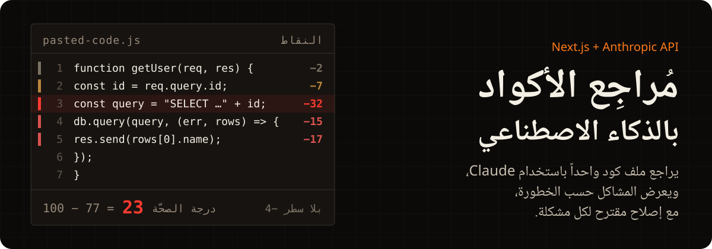
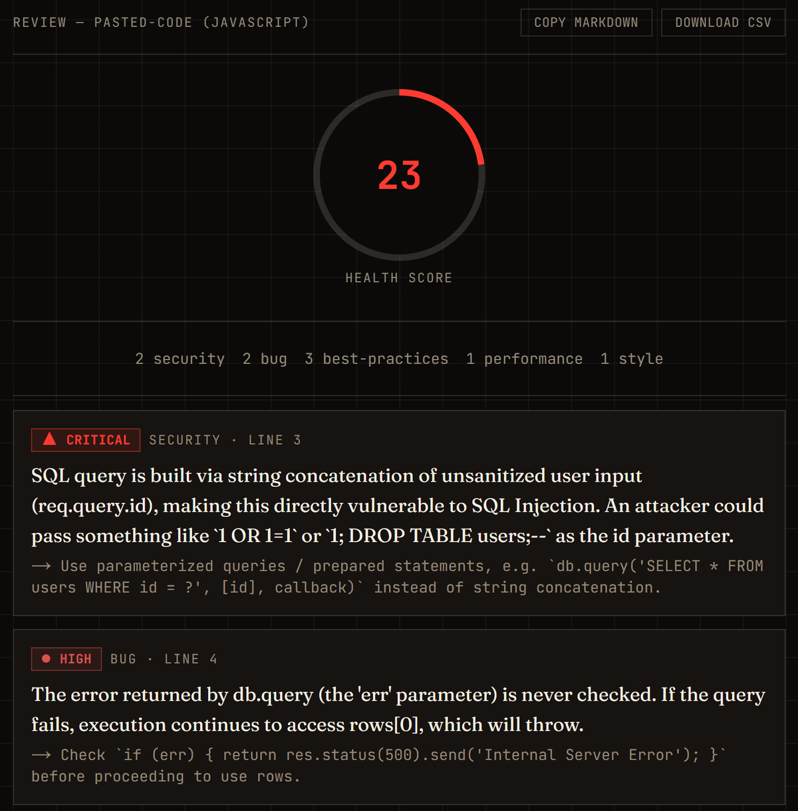
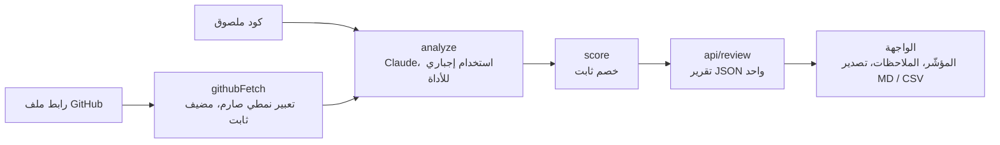

<div align="left">

[English](README.md) · **العربية**

</div>

<p align="center">
  
</p>

<p align="center">
  <a href="https://ai-code-reviewer-coral-five.vercel.app"></a>
  
  
  
  
</p>

<div dir="rtl">

تطبيق Next.js يراجع ملف كود واحداً باستخدام Claude. تلصق الكود أو رابط ملف من GitHub، فيعرض التطبيق المشاكل التي وجدها Claude، ولكل مشكلة درجة خطورة وفئة وإصلاح مقترح. الفئات هي: الأمان والأخطاء والأداء والأسلوب وأفضل الممارسات. درجة الصحّة (Health Score) هي 100 ناقص عدد ثابت من النقاط عن كل ملاحظة. يمكنك نسخ المراجعة بصيغة Markdown لتضعها تعليقاً على Pull Request، أو تنزيلها ملف CSV.

**[افتح التطبيق المباشر ←](https://ai-code-reviewer-coral-five.vercel.app)**

## مثال على مراجعة

<p align="center">
  
</p>

لصقت دالة Express من سبعة أسطر، فأعاد التطبيق تسع ملاحظات. أولها حقن SQL حرج في السطر 3، وكانت الدرجة 23. [لقطة الشاشة بالملاحظات التسع كلها](screenshots/review.png).

## طريقة حساب الدرجة

يعيد Claude الملاحظات ويعطي كل واحدة درجة خطورة. الأداة التي يملؤها لا تحتوي على حقل للدرجة. يبدأ [`lib/score.ts`](lib/score.ts) من 100 ويخصم نقاطاً عن كل ملاحظة:

| الخطورة | النقاط المخصومة |
|---|---:|
| حرجة (critical) | ‎−25 |
| عالية (high) | ‎−15 |
| متوسطة (medium) | ‎−7 |
| منخفضة (low) | ‎−2 |

لا تنزل الدرجة تحت الصفر، ونفس قائمة الملاحظات تعطي نفس الدرجة في كل مرة. مشروعي الآخر [مُدقّق المواقع بالذكاء الاصطناعي](https://github.com/MohammedAltounsi/AI-Website-Auditor) يستخدم جدولاً مشابهاً، لكنه يدخل في المتوسط أيضاً درجات من واجهة خارجية. هذا التطبيق لا يستخدم أي واجهة تقييم خارجية، فالحساب كله من الجدول أعلاه.

## طريقة العمل

</div>



<div dir="rtl">

<details>
<summary><b>شرح الملفات</b></summary>

1. **`lib/githubFetch.ts`** يقسم رابط ملف GitHub بتعبير نمطي إلى `owner`/`repo`/`branch`/`path`، ثم ينزّل الملف من `raw.githubusercontent.com`. اسم المضيف مكتوب ثابتاً في الكود، ولا يدخل في الطلب من رابط المستخدم إلا الأجزاء التي استخرجها التعبير النمطي. لذلك لا يستطيع المستخدم أن يجعل الخادم يطلب من مضيف آخر (SSRF).
2. **`lib/analyze.ts`** يرسل الكود إلى Claude مع الاستخدام الإجباري للأداة (`tool_choice: { type: 'tool', name: 'submit_code_review' }`). يضطر Claude إلى الرد عبر هذه الأداة، فيصل للتطبيق كائن JSON بالشكل الذي يحدده مخطط الأداة، وليس نصاً حراً.
3. **`lib/score.ts`** يحسب درجة الصحّة من قائمة الملاحظات.
4. **`app/api/review/route.ts`** يشغّل هذه الخطوات بالترتيب ويعيد تقرير JSON واحداً. يرفض الكود الملصوق إذا زاد على 50,000 حرف، ويوقف `githubFetch` التنزيل عند 200,000 بايت.
5. **`app/page.tsx` + `app/components/*`** فيها زر التبديل بين لصق الكود ورابط GitHub، ومؤشر الدرجة المتحرك، وعدد الملاحظات في كل فئة، والملاحظات مع شارة الخطورة، وتصدير Markdown وCSV.

</details>

## التشغيل محلياً

</div>

```bash
npm install
cp .env.local.example .env.local   # ثم ضع ANTHROPIC_API_KEY (console.anthropic.com)
npm run dev
```

<div dir="rtl">

الاختبارات:

</div>

```bash
npm test
```

<div dir="rtl">

**التقنيات:** Next.js (App Router) وTypeScript وTailwind، وواجهة Anthropic (`claude-sonnet-5` مع الاستخدام الإجباري للأداة)، وVitest وTesting Library.

## الحدود

**ملاحظة:** التطبيق لا يشغّل الكود. يرسله إلى Claude نصاً فقط، ولا توجد بيئة معزولة ولا نسخ للمستودع.

- يراجع ملفاً واحداً في كل مرة: كوداً ملصوقاً أو رابط ملف واحد من GitHub.
- التعبير النمطي يتوقع اسم فرع لا يحتوي على `/`. هذا يكفي لـ `main` و`master` و`develop` وأغلب فروع الميزات. أما فرع مثل `feature/x` فينقسم عند أول `/`، فيرد GitHub بالخطأ 404، ويعيد التطبيق خطأ 400 يطلب منك التأكد من الرابط واسم الفرع.

<details>
<summary><b>خطوات ممكنة لاحقاً</b></summary>

- مراجعة مستودع كامل: المرور على شجرة الملفات واختيار الملفات والتعامل مع حدود طلبات GitHub. هذا مشروع أكبر بكثير.
- تلوين الكود في حقل اللصق (CodeMirror أو Monaco).
- تحديد عدد الطلبات لكل عنوان IP عبر Vercel KV إذا صار على النسخة التجريبية استخدام فعلي.
- مراجعة diff ملصوق بدل ملف كامل.

</details>

---

<p align="center">تطوير: <b>محمد الطنسي</b> · <a href="https://www.linkedin.com/in/mohammed-altounsi/">لينكدإن</a></p>

</div>
