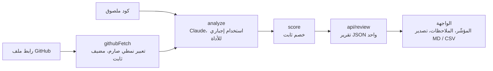

<div align="left">

[English](README.md) · **العربية**

</div>

<p align="center">
  
</p>

<p align="center">
  <a href="https://ai-code-reviewer-coral-five.vercel.app"></a>
  
  
  
  
</p>

<div dir="rtl">

الصق كوداً أو رابط ملف من GitHub، وتصلك مراجعة منظّمة: درجة صحّة للكود (Health Score)، وملاحظات مصنّفة حسب الفئة (أمان، أخطاء، أداء، أسلوب، أفضل الممارسات)، مرتّبة حسب الخطورة، ولكلٍّ منها إصلاح محدّد. تُصدَّر المراجعة بصيغة Markdown لتعليق على Pull Request، أو بصيغة CSV.

**[افتح التطبيق المباشر ←](https://ai-code-reviewer-coral-five.vercel.app)**

## مراجعة حقيقية

<p align="center">
  
</p>

دخلت دالة Express من سبعة أسطر، وخرجت تسع ملاحظات أوّلها حقن SQL حرِج في السطر 3، فاستقرّت الدرجة عند 23. [اللقطة الكاملة بكل الملاحظات التسع](screenshots/review.png).

## لماذا يُعتمد على الدرجة

النموذج لا يكتب درجة الصحّة أبداً. يحدّد Claude الخطأ ومدى خطورته، ثم تحوّل معادلة ثابتة في [`lib/score.ts`](lib/score.ts) ذلك إلى رقم، بالطريقة نفسها في كل مرة:

| الخطورة | النقاط المخصومة |
|---|---:|
| حرِجة (critical) | ‎−25 |
| عالية (high) | ‎−15 |
| متوسّطة (medium) | ‎−7 |
| منخفضة (low) | ‎−2 |

تبدأ الدرجة من 100 ولا تنزل تحت الصفر. يتبع المشروع الشقيق [مُدقّق المواقع بالذكاء الاصطناعي](https://github.com/MohammedAltounsi/AI-Website-Auditor) القاعدة نفسها، لكن هنا لا توجد واجهة تقييم خارجية نأخذ متوسّطها، فيحمل جدول الخصم الوزن كله.

## كيف يعمل

</div>



<div dir="rtl">

<details>
<summary><b>ملفاً ملفاً</b></summary>

1. **`lib/githubFetch.ts`** يحلّل رابط ملف GitHub بتعبير نمطي صارم إلى `owner`/`repo`/`branch`/`path`، ثم يجلبه من `raw.githubusercontent.com`. الكود يبني هذا المضيف بنفسه، ولا يأخذه من مُدخل المستخدم. بهذا تختفي فئة ثغرات SSRF من أساسها: لا يوجد جلب من مضيف عشوائي نحمي منه، لأن الكود يحدّد الوجهة لا الطلب.
2. **`lib/analyze.ts`** يرسل الكود إلى Claude مع الاستخدام الإجباري للأداة (`tool_choice: { type: 'tool' }`)، فتأتي الاستجابة دائماً كائناً منظّماً مُتحقَّقاً منه، لا نصاً حرّاً يحتاج إلى تحليل.
3. **`lib/score.ts`** يحسب درجة الصحّة من قائمة الملاحظات.
4. **`app/api/review/route.ts`** يشغّل خط المعالجة، ويضع حدّاً قدره 50 كيلوبايت للكود الملصوق و200 كيلوبايت لجلب GitHub، ويعيد تقريراً واحداً بصيغة JSON.
5. **`app/page.tsx` + `app/components/*`** تضمّ مبدّل لصق الكود أو رابط GitHub، ومؤشّر درجة الصحّة المتحرّك، وأعداد الفئات، والملاحظات الموسومة بالخطورة، وتصدير Markdown وCSV.

</details>

## التشغيل محلياً

</div>

```bash
npm install
cp .env.local.example .env.local   # ثم ضع ANTHROPIC_API_KEY (console.anthropic.com)
npm run dev
```

<div dir="rtl">

الاختبارات:

</div>

```bash
npm test
```

<div dir="rtl">

**التقنيات:** Next.js (App Router) وTypeScript وTailwind، وواجهة Anthropic (`claude-sonnet-5` مع الاستخدام الإجباري للأداة)، وVitest وTesting Library.

## النطاق والحدود

**ملاحظة:** الكود لا يُشغَّل أبداً. يُرسَل إلى Claude نصاً للتحليل الساكن فقط، بلا بيئة عزل ولا استنساخ للمستودع.

- يراجع ملفاً واحداً في كل مرة: مقتطفاً ملصوقاً أو رابط ملف واحد من GitHub.
- التعبير النمطي لرابط GitHub يفترض أن اسم الفرع لا يحتوي على `/`. هذا يغطّي `main` و`master` و`develop` ومعظم فروع الميزات. فرع مثل `feature/x` يُرجع خطأ 400 واضحاً بدل تحليل خاطئ.

<details>
<summary><b>خطوات ممكنة لاحقاً</b></summary>

- مراجعة المستودع كاملاً (المرور على الشجرة، واختيار الملفات، والتعامل مع حدود الطلبات). هذا منتج أكبر بكثير من الحالي.
- تلوين الصياغة في حقل اللصق (CodeMirror أو Monaco).
- تحديد عدد الطلبات لكل عنوان IP (Vercel KV) عند وصول استخدام حقيقي.
- مراجعة تعتمد على الفروقات: لصق diff بدل ملف كامل.

</details>

---

<p align="center">تصميم وتطوير بالكامل: <b>محمد الطنسي</b> · <a href="https://www.linkedin.com/in/mohammed-altounsi/">لينكدإن</a></p>

</div>
