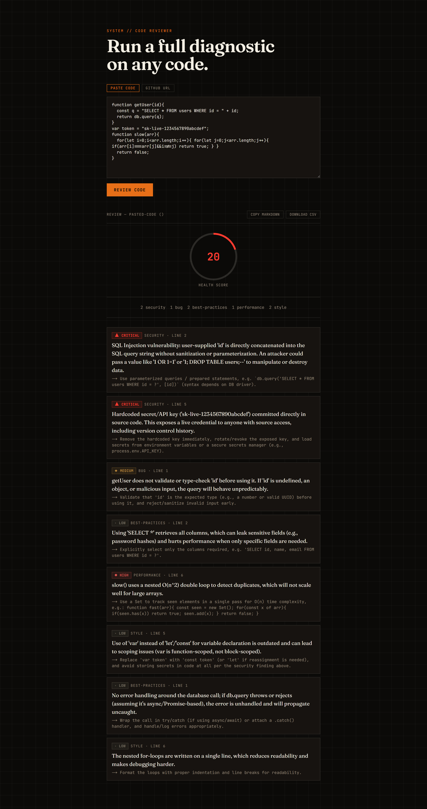

<div align="center">

[English](README.md) · **العربية**

</div>

# مُراجِع الأكواد بالذكاء الاصطناعي

الصق كوداً، أو رابط ملف من GitHub، لتحصل على مراجعة منظّمة: درجة صحّة للكود
(Health Score)، وملاحظات مصنّفة حسب الفئة (أمان، أخطاء، أداء، أسلوب،
أفضل الممارسات)، مرتّبة حسب الخطورة، ولكل ملاحظة إصلاح محدّد. صدّر النتيجة
كـ Markdown (لتعليق على Pull Request) أو CSV.

**🔗 الموقع المباشر:** https://ai-code-reviewer-coral-five.vercel.app

تصميم وتطوير بالكامل: **محمد الطنسي** — [لينكدإن](https://www.linkedin.com/in/mohammed-altounsi/)

---

## لقطة



## القرار التصميمي الأساسي

درجة الصحّة لا يولّدها النموذج إطلاقاً. هي معادلة خصم نقاط ثابتة تُطبّق على
ملاحظات Claude المصنّفة — حرِج ‎−25‎، عالٍ ‎−15‎، متوسّط ‎−7‎، منخفض ‎−2‎،
بحدٍّ أدنى صفر — تُحسب في الكود في كل مرة. Claude يقرّر ما الخطأ وما مدى
خطورته، والحساب يقرّر الرقم. نفس المبدأ في المشروع الشقيق [مُدقّق المواقع
بالذكاء الاصطناعي](https://github.com/MohammedAltounsi/AI-Website-Auditor)،
مطبّقاً هنا حيث لا توجد واجهة تقييم خارجية يُؤخذ متوسّطها.

## كيف يعمل

1. **`lib/githubFetch.ts`** — عند إعطائه رابط ملف من GitHub، يحلّله بتعبير
   نمطي صارم إلى `owner`/`repo`/`branch`/`path`، ثم يجلبه من
   `raw.githubusercontent.com` — وهو مضيف يبنيه الكود بنفسه، لا مضيف مأخوذ
   من مُدخل المستخدم. هذا يتجاوز فئة ثغرات SSRF من أساسها: لا يوجد جلب من
   مضيف عشوائي لنحمي منه، لأن وجهة الطلب يحدّدها الكود لا الطلب.
2. **`lib/analyze.ts`** — يرسل الكود إلى Claude عبر الاستخدام الإجباري للأداة
   (`tool_choice: { type: 'tool' }`)، فتكون الاستجابة دائماً كائناً منظّماً
   مُتحقَّقاً منه، لا نصاً حرّاً يُحلَّل.
3. **`lib/score.ts`** — يحسب درجة الصحّة من قائمة الملاحظات.
4. **`app/api/review/route.ts`** — يشغّل خط المعالجة، ويفرض حدّ 50 كيلوبايت
   للكود الملصوق و200 كيلوبايت لجلب GitHub، ويعيد تقريراً واحداً بصيغة JSON.
5. **`app/page.tsx` + `app/components/*`** — مبدّل بين لصق الكود ورابط
   GitHub، ومؤشّر متحرّك لدرجة الصحّة، وأعداد الفئات، وملاحظات موسومة
   بالخطورة، وتصدير Markdown وCSV.

## النطاق

يراجع ملفاً واحداً في كل مرة — مقتطفاً ملصوقاً أو رابط ملف واحد من GitHub.
لا استنساخ لمستودع كامل، ولا تنفيذ للكود ولا بيئة عزل: الكود المُرسَل يُرسَل
إلى Claude كنصّ للتحليل الساكن فقط، ولا يُشغَّل أبداً.

## التقنيات

Next.js (App Router) + TypeScript + Tailwind، وواجهة Anthropic
(`claude-sonnet-5`، استخدام إجباري للأداة)، وVitest + Testing Library.

## التشغيل

```bash
npm install
cp .env.local.example .env.local
# ضع ANTHROPIC_API_KEY (console.anthropic.com)
npm run dev
```

## الاختبار

```bash
npm test
```

## حدٌّ معروف

التعبير النمطي لرابط ملف GitHub يفترض أن اسم الفرع لا يحتوي على `/` — وهذا
يغطّي `main` و`master` و`develop` ومعظم فروع الميزات. فرع مثل `feature/x`
يُرجع خطأ 400 واضحاً بدل تحليل خاطئ.

## تحسينات مستقبلية

- وضع مراجعة المستودع الكامل (المرور على الشجرة، اختيار الملفات، التعامل مع حدود المعدّل) — منتج أكبر بكثير من هذا.
- تلوين بناء الجملة في حقل اللصق (CodeMirror/Monaco).
- تحديد المعدّل حسب عنوان IP (Vercel KV) عند وصول استخدام حقيقي.
- مراجعة واعية بالفروقات — لصق diff بدل ملف كامل.
