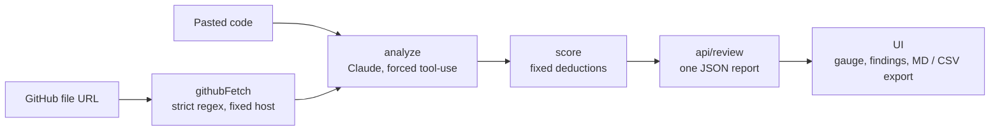

<div align="right">

**English** · [العربية](README.ar.md)

</div>

<p align="center">
  
</p>

<p align="center">
  <a href="https://ai-code-reviewer-coral-five.vercel.app"></a>
  
  
  
  
</p>

Paste code or a GitHub file URL. You get back a Code Health Score, findings grouped by category (security, bugs, performance, style, best-practices), ranked by severity, each with a specific fix. Export the review as Markdown for a PR comment, or as CSV.

**[Open the live app →](https://ai-code-reviewer-coral-five.vercel.app)**

## A real review

<p align="center">
  
</p>

A seven-line Express handler went in. Nine findings came out, led by a critical SQL injection on line 3, and the score landed at 23. [Full screenshot of all nine findings](screenshots/review.png).

## Why the score can be trusted

The model never writes the Health Score. Claude decides what is wrong and how severe it is. A fixed formula in [`lib/score.ts`](lib/score.ts) turns that into a number, the same way every time:

| Severity | Points off |
|---|---:|
| critical | −25 |
| high | −15 |
| medium | −7 |
| low | −2 |

The score starts at 100 and floors at 0. The companion project, [AI Website Auditor](https://github.com/MohammedAltounsi/AI-Website-Auditor), follows the same rule. Here there is no external scoring API to average, so the deduction table carries the whole weight.

## How it works



<details>
<summary><b>File by file</b></summary>

1. **`lib/githubFetch.ts`** parses a GitHub file URL with a strict regex into `owner`/`repo`/`branch`/`path`, then fetches from `raw.githubusercontent.com`. The code builds that host itself; it never comes from user input. That removes the SSRF problem class: there is no arbitrary-host fetch to defend, because the code fixes the destination, not the request.
2. **`lib/analyze.ts`** sends the code to Claude with forced tool-use (`tool_choice: { type: 'tool' }`), so the response is always a validated structured object, never free text to parse.
3. **`lib/score.ts`** computes the Health Score from the findings list.
4. **`app/api/review/route.ts`** runs the pipeline, caps pasted code at 50 KB and GitHub fetches at 200 KB, and returns one JSON report.
5. **`app/page.tsx` + `app/components/*`** hold the paste-code / GitHub-URL toggle, the animated Health Score gauge, category counts, severity-badged findings, and Markdown and CSV export.

</details>

## Run it locally

```bash
npm install
cp .env.local.example .env.local   # then set ANTHROPIC_API_KEY (console.anthropic.com)
npm run dev
```

Tests:

```bash
npm test
```

**Stack:** Next.js (App Router), TypeScript, Tailwind, Anthropic API (`claude-sonnet-5`, forced tool-use), Vitest and Testing Library.

## Scope and limits

> [!NOTE]
> Your code is never executed. It goes to Claude as text for static analysis only. No sandbox, no repo cloning.

- Reviews one file at a time: a pasted snippet or a single GitHub blob URL.
- The GitHub URL regex assumes the branch name has no `/`. That covers `main`, `master`, `develop` and most feature branches. A branch like `feature/x` returns a clear 400 error instead of a wrong parse.

<details>
<summary><b>Possible next steps</b></summary>

- Full-repo review (walk the tree, pick files, handle rate limits). That is a much bigger product than this one.
- Syntax highlighting in the paste box (CodeMirror or Monaco).
- Per-IP rate limiting (Vercel KV) once real traffic arrives.
- Diff-aware review: paste a diff instead of a whole file.

</details>

---

<p align="center">Built and designed end to end by <b>Mohammed Altounsi</b> · <a href="https://www.linkedin.com/in/mohammed-altounsi/">LinkedIn</a></p>
