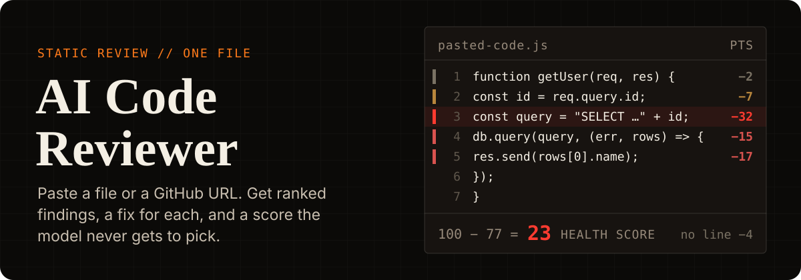
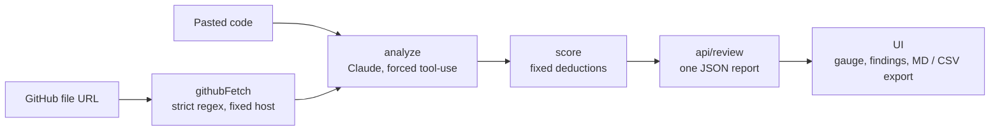

<div align="right">

**English** · [العربية](README.ar.md)

</div>

<p align="center">
  
</p>

<p align="center">
  <a href="https://ai-code-reviewer-coral-five.vercel.app"></a>
  
  
  
  
</p>

A Next.js app that reviews one file of code with Claude. You paste the code or a GitHub file URL. The app lists the problems Claude finds, each with a severity, a category and a suggested fix. The categories are security, bug, performance, style and best-practices. The Health Score is 100 minus a fixed number of points per finding. You can copy the review as Markdown for a PR comment or download it as CSV.

**[Open the live app →](https://ai-code-reviewer-coral-five.vercel.app)**

## Example review

<p align="center">
  
</p>

I pasted a seven-line Express handler. The app returned nine findings. The first one is a critical SQL injection on line 3, and the score came out at 23. [Screenshot with all nine findings](screenshots/review.png).

## How the score is calculated

Claude returns the findings and gives each one a severity. The tool schema it fills in has no score field. [`lib/score.ts`](lib/score.ts) starts at 100 and subtracts points per finding:

| Severity | Points off |
|---|---:|
| critical | −25 |
| high | −15 |
| medium | −7 |
| low | −2 |

The score stops at 0. The same list of findings always gives the same score. My other project, [AI Website Auditor](https://github.com/MohammedAltounsi/AI-Website-Auditor), uses the same kind of table but also averages in scores from an external API. This app has no external scoring API, so the table is the whole calculation.

## How it works



<details>
<summary><b>File by file</b></summary>

1. **`lib/githubFetch.ts`** splits a GitHub file URL into `owner`/`repo`/`branch`/`path` with a regex and downloads the file from `raw.githubusercontent.com`. The host is a hardcoded string. Only the parsed parts of the URL go into the request path, so a user can't make the server fetch from another host (SSRF).
2. **`lib/analyze.ts`** sends the code to Claude with forced tool-use (`tool_choice: { type: 'tool', name: 'submit_code_review' }`). Claude has to answer by calling that tool, so the app gets back a JSON object shaped by the tool's input schema instead of free text.
3. **`lib/score.ts`** computes the Health Score from the list of findings.
4. **`app/api/review/route.ts`** runs these steps in order and returns one JSON report. It rejects pasted code over 50,000 characters, and `githubFetch` stops downloading at 200,000 bytes.
5. **`app/page.tsx` + `app/components/*`** contain the switch between pasted code and GitHub URL, the animated score gauge, the count per category, the findings with severity badges, and the Markdown and CSV export.

</details>

## Run it locally

```bash
npm install
cp .env.local.example .env.local   # then set ANTHROPIC_API_KEY (console.anthropic.com)
npm run dev
```

Tests:

```bash
npm test
```

**Stack:** Next.js (App Router), TypeScript, Tailwind, Anthropic API (`claude-sonnet-5`, forced tool-use), Vitest and Testing Library.

## Limits

> [!NOTE]
> The app does not run your code. It sends the code to Claude as text. There is no sandbox and no repo cloning.

- It reviews one file at a time: a pasted snippet or one GitHub blob URL.
- The URL regex expects a branch name without `/`. That works for `main`, `master`, `develop` and most feature branches. A branch like `feature/x` gets split at the first `/`, GitHub answers 404, and the app returns a 400 error that asks you to check the URL and branch name.

<details>
<summary><b>Possible next steps</b></summary>

- Review a whole repo: walk the file tree, pick files, handle GitHub rate limits. That would be a much bigger project.
- Syntax highlighting in the paste box (CodeMirror or Monaco).
- Per-IP rate limiting with Vercel KV if the demo gets real traffic.
- Review a pasted diff instead of a whole file.

</details>

---

<p align="center">Built by <b>Mohammed Altounsi</b> · <a href="https://www.linkedin.com/in/mohammed-altounsi/">LinkedIn</a></p>
